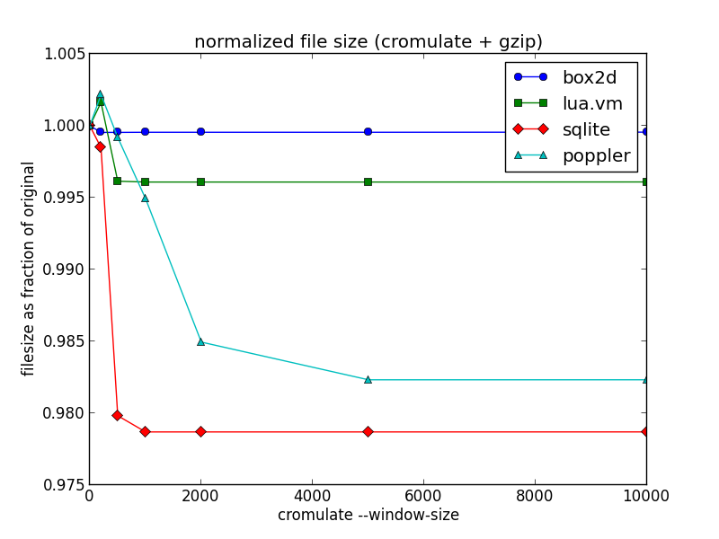
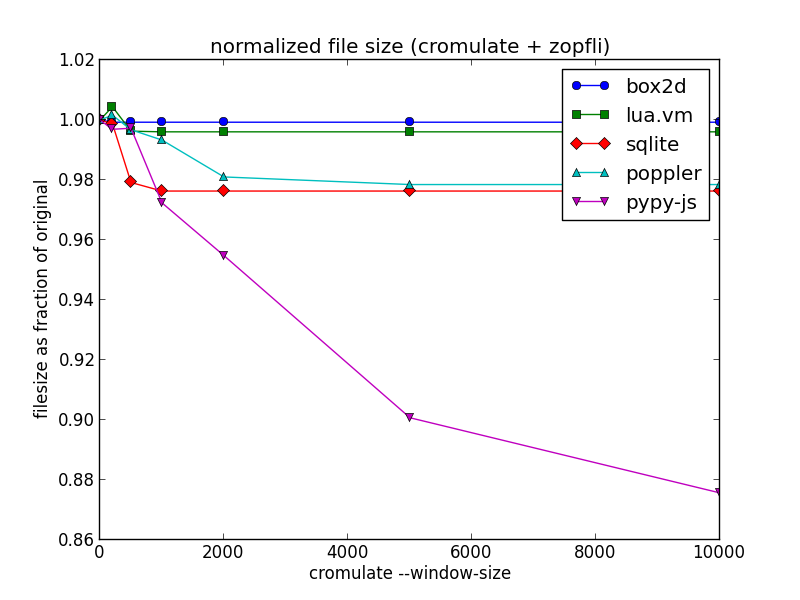

+++
title = "An Experiment in Improving Compressiblity"
date = 2014-07-17T22:01:00
updated = 2014-07-18T17:14:00
[taxonomies]
tags = ['technology', 'mozilla', 'javascript']
+++

Alternate title: **reduce your compressed file size with this one weird trick!**

One of the top items on my list for [PyPy.js](http://www.pypyjs.org) development is to reduce the size of the initial download – it currently weighs in at a hefty 3.1M of compressed javascript code plus another 2.4M of binary data.  The big wins here are clearly going to come from just generating less code, and I have made some promising initial progress on that front.  But it's also a good opportunity to experiment with some after-the-fact techniques for reducing the *compressed* filesize without having to change the actual generated code.

The obvious approach is to reach for a higher-performance compression algorithm, perhaps [bzip2](https://en.wikipedia.org/wiki/Bzip2) or [LZMA](https://en.wikipedia.org/wiki/Lempel%E2%80%93Ziv%E2%80%93Markov_chain_algorithm).  But these algorithms can suffer from slow decompression speeds and are not generally supported in today's web browsers.  For shipping compressed content on the web today, gzip is the only game in town.

So can we do better while staying within the confines of gzip?

<!-- more -->

One example of such a technique is [zopfli](https://code.google.com/p/zopfli/).  This is a gzip-compatible compressor designed to squeeze every last byte out of a file, and the project page quotes an average of around 5% smaller output than a standard `gzip -9`.  The tradeoff: compression can take 100 times longer or more to complete, although decompression speed remains the same.  It is therefore highly unsuitable for on-demand compression applications, but extremely useful for delivery of web content that is compressed once and then transmitted many times.

Replacing my existing `gzip -9` compression with zopfli gives the following size reduction:

<table style="border: 1px solid; width: 50%; white-space: nowrap;">
<tbody><tr><th style="width: 100%; padding: 0.5em">File</th><th>uncompressed</th><th>gzip -9</th><th>zopfli</th></tr>
<tr><td>pypy.js</td><td style="text-align: right">26M</td><td style="text-align: right">3.1M</td><td style="text-align: right">3.0M</td></tr>
<tr><td>pypy.js.mem</td><td style="text-align: right">9.1M</td><td style="text-align: right">2.4M</td><td style="text-align: right">2.3M</td></tr>
</tbody></table>

That's not earth-shattering, but it's not bad for a one-time payment of some extra cpu cycles! Inspired by the zopfli philosophy, I decided to look for other ways to burn cpu in exchange for better gzip compression.

The [techniques underlying gzip](https://en.wikipedia.org/wiki/LZ77_and_LZ78) are based on a sliding window approach.  The algorithm considers only a partial chunk of its input at any one time, and the particulars of the file format limit the size of this window to a maximum of 32K.  This means that if the input file contains similar chunks of code that happen to be spaced far apart, then gzip may not be able to take advantage of that similarity.

For arbitrary inputs there's nothing you can do about that, it's simply a limitation of the algorithm.  But I'm dealing with code, and chunks of code can be safely moved around.  So what would happen if we re-ordered the function definitions to put similar code closer together?

I threw together a python script to implement this idea, which was blessedly simple thanks to the highly-structured nature of the code generated by [emscripten](http://emscripten.org).  For want of an actual name for the technique, I called it [cromulate.py](https://github.com/rfk/pypyjs/blob/master/tools/cromulate.py).  It reads in an emscripten-generated javascript file, chunks up the individual function definitions, and measures the "similarity" between a pair of functions A and B by calculating `len(gzip(A)) + len(gzip(B)) - len(gzip(A + B))`.  It then uses a simple greedy selection algorithm to re-order the functions so that similar ones are closer together.  The result is a semantically-equivalent javascript file that will (hopefully) compress better than the original.

(If you squint, the underlying idea here is broadly similar to the way that bzip2 uses the [Burrows-Wheeler Transform](https://en.wikipedia.org/wiki/Burrows%E2%80%93Wheeler_transform), which does no compression itself but which re-orders data to make subsequent compression work better.  The trick of intuiting similarity by concatenating and compressing is not new either – see for example its application to linguistic analysis in [Language Trees and Zipping](http://arxiv.org/abs/cond-mat/0108530).)

Since a naive pairwise comparison of all functions would be O(n^2), I used a sliding window approach similar to gzip's to keep the running time under control.  The "--window-size" option limits the number of functions that will be considered at any one time.  By making the window larger than the 32KB limit of gzip, it is still able to find similarities that would otherwise go un-utilised.  Increasing the size of the window increases the running time, but can also improve the compressibility of the output.

To test it out, I used the existing emscripten-compiled programs from Alon's "[Massive](https://github.com/kripken/Massive)" benchmark suite.  The results are summarized below as a function of cromulation window size:

</img>

The first thing to note is that at small window sizes, the script can actually make the program *less* compressible.  But as the window size increases, and each function definition is compared to a larger portion of the file to find potential similarities, the technique is able to reduce the final compressed file size for all four programs in this test.

The "box2d" and "lua.vm" programs are fairly small, around a few hundred kilobytes, and the potential gain in compressibility is correspondingly small since similar functions are already likely to be close together.  "Poppler" and "sqlite" are larger at a few megabytes each, and show a modest but noticeable improvement of 1 to 2 percent from this approach.

Now here are the results for my current PyPy.js source file, for comparison:

</img>

That's more than a 10 percent reduction in compressed file size just by re-arranging the code – pretty neat for such a naive optimization!

I have a few theories about why the difference is so much more noticeable with PyPy.js:

* It has over 16 thousand function definitions, meaning lots of opportunities to find similarity and lots of room for small size savings to add up.
* PyPy aggressively inlines code during translation, meaning a higher likelihood of functions with a lot of similar code.
* The memory initialization data is split out into a separate file in this case, so function definitions make up a larger proportion of total file size.

In terms of running time, it took *almost six hours* for the current version of my script to process PyPy.js at the largest window size.  I did not record timing details for each run, but even the smaller files took several minutes to process.  So it's clearly not the sort of thing you want to be running regularly.  But for a final deployment build the potential size saving is hard to ignore.

It's also worth noting that the savings here are largely orthogonal to those found by zopfli.  Here's the same graph, but using zopfli for the compression rather than gzip:

</img>

The ratios have changed a little, but the overall shape of the graph is similar. My final compressed file size after cromulation and zoplification is 2.6M, a saving of more than 15 percent over the initial 3.1M we started with.  It's now almost a full second faster for me to fetch from across the Pacific.

Will this ultimately be useful in practice?  I'm not sure.  It's possible that as I get around to reducing and optimizing the code generated for PyPy.js, the relative benefit of this approach will grow smaller and smaller.  But based on the results for other codebases shown above, it seems unlikely to go to zero.

**Update:** My colleague [Francois](http://fmarier.org/) mentioned that a similar technique could be used to improve compression of CSS files, and I found [this interesting article](http://mainroach.blogspot.com.au/2013/08/css-compression-block-sorting.html) about one attempt to do so, including a [statistical technique](http://en.wikipedia.org/wiki/Kullback–Leibler_divergence) that might be useful for improving the running time of my script. 

