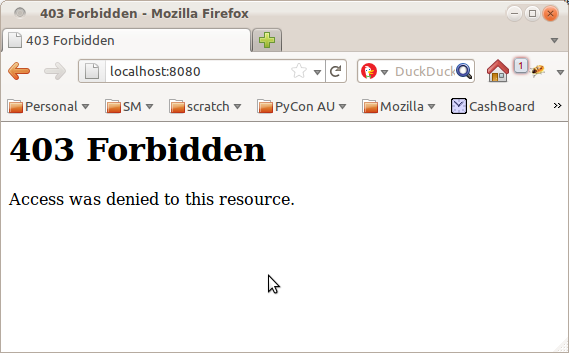
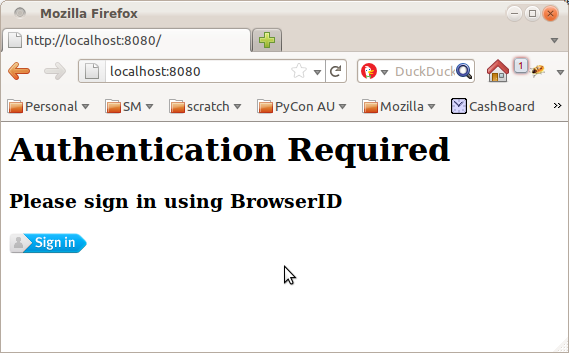

+++
title = "Painless Authentication with Pyramid and BrowserID"
date = 2011-10-20T16:08:00
updated = 2012-07-17T22:07:00
[taxonomies]
tags = ['technology']
+++


There are a couple of really exciting projects underway at Mozilla right now.

The first is [BrowserID](https://browserid.org/), a distributed single-signon system from the [Mozilla Identity Team](http://identity.mozilla.com/).  BrowserID sports a very slick sign-in process, simple integration with your existing software stack, and is designed from the ground up to provide strong [user privacy](http://identity.mozilla.com/post/7899984443/privacy-and-browserid) guarantees.

The second is [Project Sagrada](https://wiki.mozilla.org/Services/Sagrada), a platform for quickly building secure, scalable web applications from the folks I work with on the [Mozilla Services Team](http://blog.mozilla.com/services/).  While initial development is being driven by Mozilla's internal projects and needs, the hope is that one day developers will be able to just [write some simple service definitions](https://tarekziade.wordpress.com/2011/09/22/sagrada-creation-and-hosting-of-web-services/) then deploy their applications across Mozilla's infrastructure.

Of course, we're not there yet, but we're building up to it piece by piece.  One piece I've been working on, and which is coming along quite nicely if I do say so myself, is authentication.  We are building a secure, flexible and efficient authentication stack on top of some key Python web technologies such a [Pyramid](http://www.pylonsproject.org/projects/pyramid/about) and [repoze.who](http://pypi.python.org/pypi/repoze.who/).

So without further ado, here's a glimpse of my first tiny piece of Project Sagrada: adding BrowserID support to a Pyramid app with just a few lines of configuration.

<!-- more -->

Let's start with a simple "hello world" program in Pyramid:

```python 
from paste.httpserver import serve
from pyramid.config import Configurator
from pyramid.response import Response


def hello_world(request):
    return Response('Hello World!')


if __name__ == '__main__':
    config = Configurator()
    config.add_route('hello', '/')
    config.add_view(hello_world, route_name='hello')
    app = config.make_wsgi_app()
    serve(app, host='0.0.0.0')
```

Run this as a script and you'll get a delightful little webpage that says "Hello World!", like this:

</img>

Exciting stuff.

Now let's say you want to spice this up a little by including the user's name in the welcome message.  Pyramid provides the function "authenticated_userid" to obtain the username of the currently logged-in user, so we can change our "hello_world" view function to the following:


```python 

from pyramid.response import Response
from pyramid.security import authenticated_userid


def hello_world(request):
    userid = authenticated_userid(request)
    return Response('Hello %s!' % (userid,))
```

Restart the script and you will now be greeted with:

</img>

Oops.  In order to report back your username, we first have to get you to log in.  Pyramid provides a [sophisticated permission-based security system](http://docs.pylonsproject.org/projects/pyramid/1.2/narr/security.html), but for the purposes of this demonstration, let's just forbid access unless you are logged in:

```python 

from pyramid.response import Response
from pyramid.security import authenticated_userid
from pyramid.exceptions import Forbidden


def hello_world(request):
    userid = authenticated_userid(request)
    if userid is None:
        raise Forbidden()
    return Response('Hello %s!' % (userid,))
```


Restart the script again and...

</img>

Almost.  The final piece of the puzzle is configuring the authentication system.  For that, we're going to use the [pyramid_whoauth](https://github.com/mozilla-services/pyramid_whoauth)[^1] package to set up a [repoze.who](http://pypi.python.org/pypi/repoze.who/) authentication stack, and the [repoze.who browserid plugin](https://github.com/mozilla-services/repoze.who.plugins.browserid) to activate support for BrowserID.

Sounds complicated?  There are a few moving parts, but the end result is really quite simple and elegant.

Here's the important point: our view code *does not need to change*.  Instead we simply tweak the configuration of our pyramid app to hook up the necessary components:

```python 
if __name__ == '__main__':
    settings = {
      # The "auth_tkt" plugin implements signed login cookies.
      # Use it to remember the login so that you don't have to
      # click through the BrowserID dialog over and over.
      "who.plugin.authtkt.use": "repoze.who.plugins.auth_tkt:make_plugin",
      "who.plugin.authtkt.secret": "OH_SO_SECRET",

      # The "browserid" plugin lets you login with BrowserID.
      "who.plugin.browserid.use": "repoze.who.plugins.browserid:make_plugin",
      "who.plugin.browserid.audiences": "localhost:8080",
      "who.plugin.browserid.postback_url": "/login",

      # Assign plugins to each phase of the authentication process.
      "who.identifiers.plugins": "authtkt browserid",
      "who.authenticators.plugins": "authtkt browserid",
      "who.challengers.plugins": "browserid",
    }

    # Include pyramid_whoauth as part of the config.
    # It will plug itself in and take over authentication duties.
    config = Configurator(settings=settings)
    config.include("pyramid_whoauth")
    # Then continue with config as normal.
    config.add_route('hello', '/')
    config.add_view(hello_world, route_name='hello')
    app = config.make_wsgi_app()
```

The `settings` dict is used to tell repoze.who what authentication plugins it should use, and how to stitch them all together during the various phases of authentication.  In a real application these settings would be read from e.g. a PasteDeploy ini-file.

Notice that we have used the `audiences` parameter to tell BrowserID the expected URL of the site.  This may seem a little cumbersome but is an [important security feature](https://developer.mozilla.org/en/BrowserID/Security_Considerations#Specify_the_audience_parameter_explicitly).  You can specify a list of addresses and/or use
wildcards in this setting to make this a little easier during deployment. 

Restart the script again and you'll finally be greeted by a page telling you to sign in with BrowserID:

</img>

Yeah, it's ugly, nevermind that for now.  Click the button, walk through the slick BrowserID login process, and you will be rewarded with the end result:

</img>

By adding one line of code and a handful of configuration options, we've just enabled a complete login and authentication system for our pyramid app.  Thanks to BrowserID, we didn't need to set up a user database, store passwords or confirm email addresses.  Thanks to Pyramid, we didn't have to weave authentication boilerplate through all of our view functions.  And thanks to repoze.who, we can configure and tweak the authentication stack to precisely suit our needs (for example, you might like to add [OpenID support](http://quantumcore.org/docs/repoze.who.plugins.openid/) as well).

To me, that's pretty magic.

By itself this isn't exactly earth-shattering.  It's a couple of neat plugins built on top of existing python libraries.  But this is exactly the sort of thing I hope to see coming out of Project Sagrada as it picks up steam – a continuous stream of small victories, useful abstractions and simplifying frameworks that, when you add them all together, build up to a compelling development and deployment infrastructure for web services applications.

[^1]: By the way, there's an existing pyramid plugin called [pyramid_who](https://pypi.org/project/pyramid_who/) that also provides hooks between pyramid and repoze.who; pyramid_whoauth tries to provide more functionality out of the box, and hence makes more decisions for you up front.  This may or may not be what you want.
