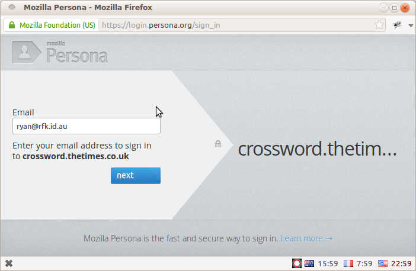
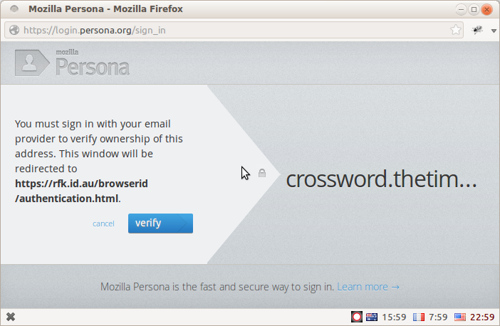

+++
title = "rfk.id.au is now a Persona Identity Provider"
date = 2012-09-06T15:10:00
updated = 2012-09-06T15:10:00
[taxonomies]
tags = ['technology']
+++

After a few days of hacking, "rfk.id.au" now acts as an Identity Provider for the BrowserID protocol, a.k.a [Mozilla Persona](https://login.persona.org/about).  This means I can now log in as **ryan@rfk.id.au** on any persona-enabled website while retaining complete control over my identity.  I do not have to delegate my details or my credentials to a third party, even one that I would trust as much as Mozilla.

Here's the [BrowserID support document](/.well-known/browserid) to prove it.

<!-- more -->

*(**Edit:** Mozilla Persona has since been shut down, and the above link no longer works; I'm keeping the post live for historical interest.)*

My setup has some peculiarities, but it's not terribly different to what an email hosting company might construct to provide Identity Provider services for its users.  In this post I will explain the new capabilities that this setup now gives me, and show some of the technical details of the implementation.

### What?

Suppose I visit a persona-enabled site like [The Times Crossword](http://crossword.thetimes.co.uk/) and log in using Persona.  Here's what I will see, and a high-level description of what will happen behind the scenes.  A full definition of the BrowserID protocol and related terminology is available at the [id-specs page on github.](https://github.com/mozilla/id-specs/blob/prod/browserid/index.md#terms)

First, I will see a popup dialog into which I enter my email address:

[</img>](./login_step1.png)

When I click next, this dialog will check whether my email domain provides native support for the BrowserID protocol.  It attempts to load a "BrowserID Support Document" from [https://rfk.id.au/.well-known/browserid](/.well-known/browserid), and since I have just set one up this request will succeed.

The dialog informs me that I can sign in with native support from my email provider:

[</img>](./login_step2.png)

Behind the scenes, the support document has provided three pieces of information which will be used to orchestrate the login process:

* A link to an "authentication page".  This page will be responsible for prompting me for my password and establishing an authenticated login session to my domain.
* A link to a "provisioning" page".  This page will be responsible for producing an "Identity Certificate" signed using a cryptographic private key known only to my domain.
* A cryptographic public key.  This key can be used by anyone to verify identity certificates issued by my domain.

Having loaded this information, the Persona login dialog will now display the authentication page for my domain, which in this case is [/browserid/authentication.html](/browserid/authentication.html):

[</img>](./login_step3.png)

Clearly I have not put a lot of work into prettying this up, but that's not really the point.

The key point is that the authentication page is hosted on my own domain and I have complete control over it.  The browser's strong cross-domain security model means that when I enter my password on this page, I can be safe in the knowledge that it will not be leaked to some third-party service.  (Although there is one slight, temporary caveat to this bold claim, which I'll discuss below).

Once I enter my password, the page stores some login session data in the browser and executes a callback to inform the Persona dialog that I have been successfully authenticated.

Next the dialog loads my provisioning page, which in this case is [/browserid/provisioning.html](/browserid/provisioning.html).  If you click through that link you'll see that there's no visible content on that page.  Instead, all of the magic happens in the background via javascript.  The provisioning page detects that I have a valid login session, uses my domain's private key to generate a signed certificate verifying my identity, and passes this back to the Persona dialog via a callback.

Again, note that this page is hosted entirely on my own domain and is completely under my control.  No details of the private key or login session can be leaked to third-party services.

The dialog stores my identity certificate in the browser for use during future login sessions, then uses it to generate a short-lived "Identity Assertion".  The login process now completes, and passes the identity assertion back to the target website:

[</img>](./login_step4.png)

The target site will validate my identity assertion by following the chain of cryptographic signatures back up to the public key that I have published for my domain.

There's a lot going on behind the scenes here, but the Persona login dialog does a great job of hiding it away.  Behind that slick interface, the use of public-key cryptography gives this login process two important features that bear repeating:

* I can login by entering my password on a site that I control.  Neither the target website site nor Mozilla ever need to be trusted with my credentials.  This is an important level of control over my **security**.
* The target website can verify my credentials by retrieving the public key directly from my domain.  It does not need to pass my details to Mozilla or to any other third-party site, depriving them of an opportunity to track my activities online.  This is an important level of control over my **privacy**.

However, I must note that there are two temporary caveats to the above, due to Persona still being under heavy development.

First, most persona-enabled sites verify identity assertions by [POSTing them to a Mozilla-hosted service](https://developer.mozilla.org/en-US/docs/Persona/Quick_Setup#Step_4.3A_Verify_the_user.E2.80.99s_credentials).  If Mozilla were so inclined, they could use this data to track my browsing habits.  But once the data formats for the BrowserID protocol have stabilised, it will make both moral and economic sense for sites to [verify assertions locally](https://github.com/mozilla/PyBrowserID) and avoid leaking details of my browsing habits.

Second, the authentication and provisioning pages include [third-party javascript files](https://login.persona.org/authentication_api.js) that are hosted on persona.org.  If the Persona servers were compromised, someone could potentially inject malicious javascript into my pages in order to steal my credentials.  But once the internal Persona APIs have stabilised, I will be able to host snapshots of these files on my own server and close this slight chink in the armour for good.

All in all, I am very happy with the result.

### How?

The Persona developer docs have a very good introduction to [Implementing an Identity Provider](https://developer.mozilla.org/en-US/docs/Persona/Implementing_a_Persona_IdP), so I will not repeat all the details here.  Instead I will highlight some of the key aspects of my implementation.

#### The Code

The authentication and provisioning pages I linked to above are very simple HTML documents, and almost all of the heavy-lifting is done in javascript.  The custom code lives in a small javascript file called [personalIDP.js](/browserid/personalIDP.js), which in turn depends on the javascript crypto code like [jwcrypto](https://github.com/mozilla/jwcrypto) that is published as part of Mozilla Persona.

It's open-source and [available on github](https://github.com/rfk/www.rfk.id.au/tree/master/content/browserid), so if you're feeling adventurous then feel free to play around with it and re-purpose it for your own site.  But do read on for some important security disclaimers...

#### SSL

The security of the BrowserID protocol depends heavily on SSL to authenticate each Identity Provider.  Without it, anyone could set up a spoof "rfk.id.au" site and claim to be providing persona support with their own set of keys.

Being a simple personal website, I had never bothered to set up SSL for this domain, and I was worried that the expense of doing so might make this whole endeavour a non-starter.  Fortunately it is possible to obtain **free** personal SSL certificates from [StartCom](https://www.startssl.com/) without too much hassle.  These certificates are accepted without complaint by all major browsers and by the persona.org verifier service.

#### Private Key Security

Here's where things get tricky: there is no server-side code behind this website.

It's a bunch of static HTML and javascript files, hosted on a cheap VPS and served by nginx, and I feel very strongly about keeping it that way.  But this poses a bit of a problem for any authentication system that depends on keeping data secret.  I can't just squirrel the private key away on my server somewhere and generate identity certificates via an HTTP call.  Instead, I have to be able to generate certificates client-side, in javascript, without compromising my security.

I've come up with a solution which I ***think*** should be secure enough for my purposes.  If any security gurus want to show me how wrong I am, I'm all ears.

If you take another peek at my [BrowserID support document](/.well-known/browserid), you'll see it has an additional field called "encrypted-private-key".  That's the private key data, encrypted with a passphrase known only to me.  When I visit the authentication page it will prompt for my passphrase, use it to decrypt the private key data, then store it in the browser's [sessionStorage](https://developer.mozilla.org/en-US/docs/DOM/Storage#sessionStorage) object.  When I visit the provisioning page it will read the decrypted private key data from sessionStorage and use it to sign the necessary certificates.

This works well enough, but it does have some important security considerations:

* Anyone so inclined could download the private key data and try to brute-force the encryption.  Assuming I haven't screwed up in my use of the [Stanford Javascript Crypto Library](http://crypto.stanford.edu/sjcl/), I say to you: good luck!  But I will need to rotate the key regularly to keep it safe from any determined attackers, so I built a little [Key Change](/browserid/keychange.html) page to make that easy.
* Anyone who can read my sessionStorage data could steal the decrypted private key.  The browser *should* protect me here, since sessionStorage comes with a strong same-origin security policy and is purged when the login dialog closes.  But bugs do happen.  (Thanks to [François Marier](http://fmarier.org/) for suggesting that sessionStorage would be safer than cookies for this data).
* Anyone who knows my passphrase can authenticate with any address on the "rfk.id.au" domain.  Since I'm the only one who knows it, and the only person with addresses on that domain, this is an acceptable compromise.  Obviously it wouldn't work out so well for domains with multiple users.

**To emphasise:** a real multi-user setup would generate certificates by making an authenticated HTTP request, so that the private key never has to leave the server.

If I had any custom server code running already, I would do the certificate signing on the server.  If you have custom server code running already, then **you should do the certificate signing on the server**.  The above is, frankly, a hack so that I can avoid the need to sysadmin anything.  It's possible that I will live to regret my [Engineering Hubris](http://xkcd.com/319/).

So that's that.  A bit of javascript, a few HTML pages and a JSON blob allow this domain to provide me with simple, secure logins on any persona-enabled website.  I think that's pretty amazing.  Many thanks to the [Mozilla Identity Team](http://identity.mozilla.com/) for their work on this great new way to authenticate.

