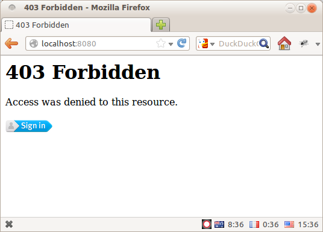
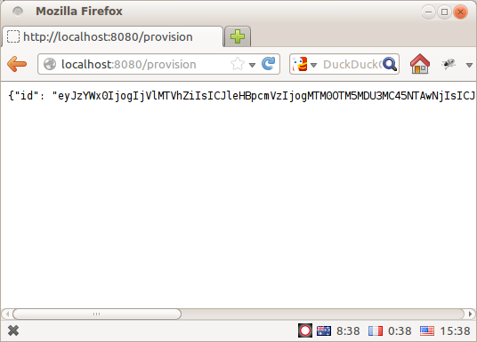
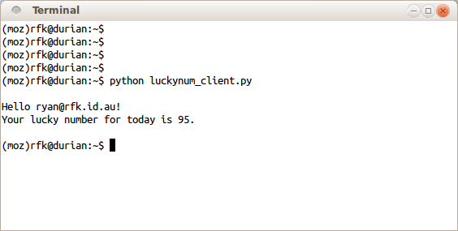

+++
title = "Securing Pyramid with Persona and MACAuth"
date = 2012-10-04T23:07:00
updated = 2012-10-07T23:34:00
[taxonomies]
tags = ['technology', 'python']
+++


[Mozilla Persona](https://login.persona.org/) went into beta release last week, and it has been very exciting to see the interest and positive press it has generated.  I particularly liked the release of [pyramid_persona](http://pypi.python.org/pypi/pyramid_persona) and the accompanying article [Quick authentication on pyramid with persona](http://compiletoi.net/quick-authentication-on-pyramid-with-persona.html) – it is cleaner, simpler, and more feature-full than [my attempt at Pyramid/BrowserID integration](/blog/entry/painless-auth-pyramid-browserid/) from last year.  Great stuff!

But there is one weak point to using Persona for authentication: it makes automated access difficult.  The login flow depends heavily on javascript and assumes that authentication will involve a real live user and a full-blown web-browser.  Scripting access to your site via something like [requests](http://docs.python-requests.org/en/latest/) would be tricky at best, and downright impossible in the general case.

Most of the webapps we build at [Mozilla Services](https://wiki.mozilla.org/Services/) are meant for machines, not people, so we've had to tackle this problem head-on.  We have found that a *combined* authentication approach works very nicely – we provide Persona for live users, and the much more automation-friendly [MAC Access Authentication](http://tools.ietf.org/html/draft-ietf-oauth-v2-http-mac) for machines.

In this post I'll show you how easy it can be to combine the two, using [pyramid_persona](http://pypi.python.org/pypi/pyramid_persona) and [pyramid_macauth](http://pypi.python.org/pypi/pyramid_macauth) for the heavy lifting, and [pyramid_multiauth](http://pypi.python.org/pypi/pyramid_multiauth) to tie them both together.

<!-- more -->


### Example: The Lucky Number Service

To begin, let's take a very silly example service that you might build with pyramid.  It's authenticated using Mozilla Persona, and you can login to generate a lucky number.  Using [pyramid_persona](http://pypi.python.org/pypi/pyramid_persona) makes this a breeze:

```python 
import random
import wsgiref.simple_server

from pyramid.config import Configurator
from pyramid.response import Response
from pyramid.security import authenticated_userid
from pyramid.exceptions import Forbidden


TEMPLATE = """
Hello {userid}!
Your lucky number for today is {number}.
"""


def lucky_number(request):
    """Pyramid view to generate a lucky number."""

    # Check that the user is authenticated.
    userid = authenticated_userid(request)
    if userid is None:
        raise Forbidden()

    # Generate and return the lucky number.
    number = random.randint(1,100)
    return Response(TEMPLATE.format(**locals()), content_type="text/plain")


def main():
    """Construct and return a WSGI app for the luckynumber service."""

    settings = {
      # The pyramid_persona plugin needs a master secret to use for
      # signing login cookies, and the expected hostname of your website
      # to prevent fradulent login attempts.
      "persona.secret": "TED KOPPEL IS A ROBOT",
      "persona.audiences": "localhost:8080",
    }

    config = Configurator(settings=settings)
    config.add_route("number", "/")
    config.add_view(lucky_number, route_name="number")

    # Including pyramid_persona magically enables authentication.
    config.include("pyramid_persona")

    return config.make_wsgi_app()


if __name__ == "__main__":
    app = main()
    server = wsgiref.simple_server.make_server("", 8080, app)
    server.serve_forever()
```

Full runnable source-code is here: [luckynum_server_orig.py](./luckynum_server_orig.py).  Run it as a script and you'll get a delightful little webpage that asks you to login with Persona:

</img>

Click through the [slick Persona login flow](https://www.rfk.id.au/blob/entry/persona-identity-provider/) and you'll get your lucky number!](None)

</img>

But let's say you're a junkie for this kinda of stuff (or a compulsive gambler...) and you want to write a script to fetch your lucky number on a regular basis.  Using just the Persona authentication API, you're out of luck – it's entirely javascript-driven so there is no easy way to automate the login step from above.

You could script something against the [persona.org web-service API](https://github.com/mozilla/browserid/tree/dev/lib/wsapi), but that's an internal implementation detail so it might change without notice.  You could launch and drive a full-blown browser using something like [Selenium](http://seleniumhq.org/) or [Sikuli](http://sikuli.org/), but that's pretty fragile and not exactly user-friendly.  It would be better if the web service itself supported a machine-drivable authentication mechanism in addition to Persona.

Enter [MAC Access Authentication](http://tools.ietf.org/html/draft-ietf-oauth-v2-http-mac).


### MACAuth on the Server

MAC Access Auth is a simple request-signing scheme, originally designed as part of [OAuth 2](http://oauth.net/2/) but eminently usable as a stand-alone specification.  Each client gets a unique id and secret key, which are roughly analogous to a username and password.  Authentication is performed by constructing a [HMAC signature](http://en.wikipedia.org/wiki/HMAC) of the request using the secret key, and including it in the Authorization header like this:

```
    GET /protected_resource HTTP/1.1
    Host: example.com
    Authorization: MAC id="h480djs93hd8",
                       ts="1336363200",
                       nonce="dj83hs9s",
                       mac="bhCQXTVyfj5cmA9uKkPFx1zeOXM="
```

Note that the secret key itself is not sent over the wire.  Instead, the server authenticates the request by looking up its own copy of the secret key for the given id, and checking that the "mac" signature from the request was correctly generated using that key.  From a security standpoint this is a [very](http://benlog.com/articles/2009/12/22/its-a-wrap/) [good](http://hueniverse.com/2010/09/oauth-bearer-tokens-are-a-terrible-idea/) [idea](http://benlog.com/articles/2010/09/07/defending-against-your-own-stupidity/).

If you know about [HTTP Digest Auth](https://tools.ietf.org/html/rfc2617#section-3) then this should look familiar, but is substantially more secure.  If you've ever had the misfortune of dealing with [Two-Legged OAuth](http://cakebaker.42dh.com/2011/01/10/2-legged-vs-3-legged-oauth/), MAC Access Auth will be a breath of fresh air.

To add MACAuth support into our lucky-number service, we can use the [pyramid_macauth](http://pypi.python.org/pypi/pyramid_macauth) library.

The real trick, however, is providing both Persona *and* MACAuth support in a convenient manner.  The [pyramid_multiauth](http://pypi.python.org/pypi/pyramid_multiauth) plugin makes this simple – it lets you configure multiple pyramid authentication policies, arranged in a stack, and delegate authentication duties to each of them in turn. 

Here's how it would look in code:

```python 
def main():
    """Construct and return a WSGI app for the luckynumber service."""

    settings = {
      # The pyramid_persona plugin needs a master secret to use for
      # signing login cookies, and the expected hostname of your website
      # to prevent fradulent login attempts.
      "persona.secret": "TED KOPPEL IS A ROBOT",
      "persona.audiences": "localhost:8080",

      # The pyramid_macauth plugin needs a master secret to use for signing
      # its access tokens.  We could use the same secret as above, but it's
      # generally a good idea to use different secrets for different things.
      "macauth.master_secret": "V8 JUICE IS 1/8TH GASOLINE",

      # The pyramid_multiauth plugin needs to be told what sub-policies to
      # load, and the order in which they should be tried.
      "multiauth.policies": "pyramid_persona pyramid_macauth",
    }

    config = Configurator(settings=settings)
    config.add_route("number", "/")
    config.add_view(lucky_number, route_name="number")

    # Including pyramid_multiauth magically enables authentication, loading
    # both of the policies we specified in the settings.
    config.include("pyramid_multiauth")

    # Both of our chosen policies configure a "forbidden view" to handle
    # unauthenticated access.  We have to resolve this conflict by explicitly
    # picking which one we want to use.
    config.add_forbidden_view("pyramid_persona.views.forbidden")

    return config.make_wsgi_app()
```


This configures our pyramid app to accept authentication *either* interactively via the persona dialog, or automatically using a set of MACAuth credentials.  Note that there have been no changes to the application code itself, we have just tweaked the configuration and settings to enable the additional authentication mechanism.

There's one final piece needed: how do we get a set of MACAuth credentials in the first place?  We will define another view for the application, where a user can login with Persona and generate a fresh set of credentials:

```python 
from pyramid.interfaces import IAuthenticationPolicy
from pyramid_macauth import MACAuthenticationPolicy

def provision_creds(request):
    """Pyramid view to provision MACAuth credentials."""

    # Check that the user is authenticated.
    userid = authenticated_userid(request)
    if userid is None:
        raise Forbidden()

    # Get a reference to the MACAuthenticationPolicy plugin.
    policy = request.registry.getUtility(IAuthenticationPolicy)
    policy = policy.get_policy(MACAuthenticationPolicy)

    # Generate a new id and secret key for the current user.
    id, key = policy.encode_mac_id(request, userid)
    return {"id": id, "key": key}
```

And hook it up in the configurator like this:

```python 

config.add_route("provision", "/provision")
config.add_view(provision_creds, route_name="provision", renderer="json")
```


Full runnable source-code is here: [luckynum_server.py](./luckynum_server.py).  Run it as a script and, in addition to the lucky-number-generating page from before, you will be able to access "/provision" and obtain some MACAuth credentials for your account:

</img>

I think it speaks very highly of pyramid as a framework that these components can be plugged together so easily and flexibly, with minimal coupling between the different pieces.


### MACAuth on the Client

We can now use the [requests](http://docs.python-requests.org/en/latest/) library to script up an automated client for this service, using the [macauthlib](http://pypi.python.org/pypi/macauthlib) package to generate the signatures.


```python 
import requests
import macauthlib

# A set of previously-provisioned MACAuth credentials.
CREDENTIALS = {
  "id": "eyJzYWx0IjogImNlMWM4YyIsICJleHBpcmVzIjogMTM0OTM5NDQ2My43OTIyOTUs"
        "ICJ1c2VyaWQiOiAicnlhbkByZmsuaWQuYXUifWyyOtRhUCI9D4I9Oz0Tho7f4-FK",
  "key": "DqvXadiE3QRySMRLnkGT5EmSvPw="
}

# Create a requests session with a hook to sign all outgoing requests.
# The macauthlib package has native support for request's data types.
def auth_hook(req):
    macauthlib.sign_request(req, **CREDENTIALS)
    return req
session = requests.session(hooks={"pre_request": auth_hook})

# Then we can easily script access to the service.
print session.get("http://localhost:8080/").content
```

Full runnable source-code is here: [luckynum_client.py](./luckynum_client.py).  If you fill in your own set of credentials and run it against your server, you should see something like this:

</img>

And that's that – a very basic Persona-enabled application that is usable by both humans and machines.

There is obviously a lot more that you could tweak here, from configuring the expiration time of the MACAuth tokens to using different secrets for different parts of your website.  To get an idea of what this might look like at scale, check out the [tokenserver system](https://wiki.mozilla.org/Services/NodeAssignment2) which will underlie the next generation of Mozilla Services products.

I am really excited to see how the ecosystem around Persona will grow over the coming months, as people try to use it in more and different settings.
