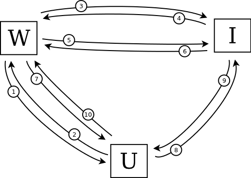
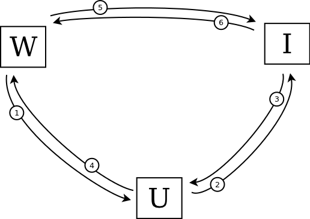

+++
title = "What I like about BrowserID"
date = 2011-09-30T14:08:00
updated = 2011-09-30T14:08:00
[taxonomies]
tags = ['technology']
+++

I'm really impressed by Mozilla's new [BrowserID](http://browserid.org) project.

A robust distributed identity infrastructure will make the internet a better place, and I'm keen to help that goal along however I can.  I was quick to jump on the [OpenID](http://en.wikipedia.org/wiki/OpenID) bandwagon when it came rolling by, and still use "[http://www.rfk.id.au](http://www.rfk.id.au)" as a delegated identity on sites that support it.  But I've never really *liked* OpenID – it has always felt clunky to me, both a UI level and as a protocol.

BrowserID fixes pretty much all of the things I dislike about OpenID, and a couple more problems that I didn't even realise I had.

<!-- more -->

First the simple stuff: identifiers.  I don't care how hard you try to get people to call them "Universal Resource Identifiers", anything that looks like "http://blah.blah.com" is a going to be thought of as a *URL*.  And a URL is something you visit.  It's not an identity, it's a location.  An address.  It's like someone asking "who are you?" and me replying with "I'm 15201 Maple Systems Road".

Despite containing the word "address", an email address is different. It's inextricably tied to a real person.  It *feels* like an identity in the same way that a Twitter handle feels like one.   It shouldn't really matter, but it does.  Signing in with a URL feels weird, signing in with an email address feels natural.

More important though, at least to me, are the details of BrowserID at the protocol level – the flow of communication between the user, the website, and the identity provider.

The entire OpenID workflow is built around HTTP redirects, with the intention that it should work just the same across all browsers.  Take a look at this (simplified) protocol diagram (that's "U" for User, "W" for Website and "I" for Identity provider):

</img>

There are 10 steps in this workflow to shuffle data between the User, the Website, and the Identity provider:

1. The Website asks the User to sign in with OpenID.
1. The User sends the Website their OpenID URL.
1. The Website looks up the URL to determine the appropriate Identity provider
1. The Identity provider sends back some metadata about the authentication.
1. The Website requests a shared secret from the Identity provider.
1. The Identity provider response with the shared secret.
1. The Website sends a token back to the User.
1. The User provides their credentials to the the Identity provider, asking them to sign the token.
1. The Identity provider sends back the signature.
1. The User provides the signed token to the Website to prove their identity.

If that's a bit hard to follow, you might like to try this [animated version narrated by lolcats](./openid_animated.gif).

Now take a look at BrowserID for comparison:

</img>

The first thing to notice is that this workflow contains only 6 steps:

1. The Website asks the User to sign in with BrowserID.
1. The User sends their credentials to the Identity provider, asking them to sign the User's public key.
1. The Identity provider sends back a signature to the User.
1. The User creates a signed assertion using their private key, and sends this to the Website along with their signed public key.
1. The Website asks the Identity provider for their public key.
1. The Identity provider sends their public key to the Website, which uses it to verify the assertion.

Again, if that's hard to follow, here it is [explained using a worn-out meme](./browserid_animated.gif).

The relative simplicity of this protocol is great, but that's not the key point.  What really makes BrowserID tick is that the three sets of interactions are *completely decoupled*.  Check it out:

* The User asks the Identity provider to sign their public key.  This has nothing to do with any particular Website.
* The Website asks the Identity provider for its public key for verification of signatures.  This has nothing to do with any particular User.
* The Website asks the User for their BrowserID, which they return along with a signature and their signed public key.  There's no need to involve the Identity provider in this exchange.

Because each interaction is decoupled, the user-agent can maintain its stash of signed identities independent of any website, caching them or refreshing them or discarding them according to its own policies.  The website can likewise keep track of the identity-provider keys on its own schedule, trusting or distrusting any particular provider as it sees fit.

This enables one of the key advantages that the BrowserID team [highlight on their site](http://identity.mozilla.com/post/7669886219/how-browserid-differs-from-openid): the BrowserID protocol respects your privacy.  Unlike OpenID, your identity provider is never sent information about what sites you are visiting or when.

